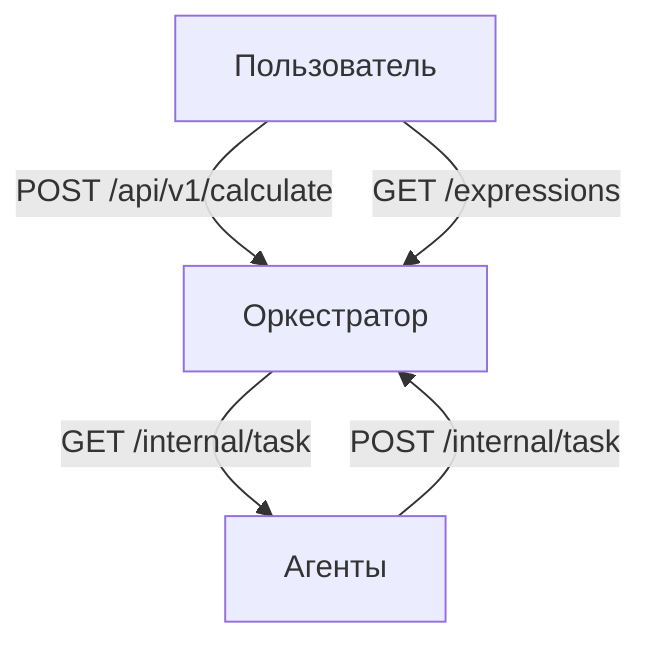

# norpn

## Описание

Этот проект представляет собой 2 приложения (оркестратор (orch) и агент).

Оркестратор реализует http для вычисления арифметических выражений. Он принимает строковое арифметическое выражение в формате json через http post-запрос (и не только :), выполняет его вычисление и возвращает ID принятого выражения. С помощью этого ID можно получить результат.

Калькулятор поддерживает стандартные арифметические операции:
- Сложение (+)
- Вычитание (-)
- Умножение (*)
- Деление (/)

Поддерживаются круглые скобки для задания порядка выполнения операций, а так же скобки внутри скобок.

---

## Архитектура



---

## Установка и запуск

### Шаг 1: Клонировать репозиторий

Клонируем репу с гитхаба и переходим на склонированную папку:

```bash
git clone https://github.com/meaqese/norpn.git
cd services
```

### Шаг 2: Запуск приложения

Для запуска выполните команды:

**Оркестратор**
```bash
go run ./cmd/orch
```

**Агент**
```bash
go run ./cmd/agent
```

_Да, на удивление здесь можно было и обойтись без Docker и Docker Compose (и даже без Kubernetes), меньше слоев, меньше памяти, меньше мусора. Совет работает только для данного случая._

>После запуска оркестратор будет доступен на порту `8080` по адресу: `http://localhost:8080`. 
>Порт можно менять в переменных окружения - `PORT`.

> Оркестратор так же принимает переменные окружения (по умолчанию везде `1000`)
> - `TIME_ADDITION_MS` - время выполнения операции сложения в миллисекундах
> - `TIME_SUBTRACTION_MS` - время выполнения операции вычитания в миллисекундах
> - `TIME_MULTIPLICATIONS_MS` - время выполнения операции умножения в миллисекундах
> - `TIME_DIVISIONS_MS` - время выполнения операции деления в миллисекундах

> Агент принимает переменную окружения COMPUTING_POWER, что указывает количеству воркеров, по умолчанию `1` 
---
## Веб-интерфейс

При запусуке оркестратора, по его адресу (по умолчанию `http://localhost:8080/`) доступен веб-интерфейс приложения, если адрес или порт
по умолчанию решили поменять, поменяйте и в `/web/main.js` константу `API_DOMAIN` для корректной работы.
___
## Описание API Оркестратора
### 1. `/api/v1/calculate`

**Метод:** POST

**Описание:** Принимает арифметическое выражение в JSON формате, выполняет вычисления и возвращает результат.

### Пример запроса:

```bash
curl -X POST http://localhost:8080/api/v1/calculate \
-H "Content-Type: application/json" \
-d '{"expression": "(2+2)*2"}'
```

Если курл не сработал, можете попробовать экранировать кавычки, - `\"`, или лучше используйте Postman

**Пример ответа (успешное выполнение - 201 Created):**

```json
{"id":"79fb15e12ecfb8a69c60bb5b8b0a33af"}
```

> `id` это MD5 хэш выражения, т.е. если отправить такой же запрос снова, он уже не будет его вычислять, т.к. выражение уже 
> вычислено.

### 2. `/api/v1/expressions`

**Метод:** GET

**Описание:** Возвращает список вычисляемых/вычисленных выражений.

#### Пример запроса:

```bash
curl http://localhost:8080/api/v1/expressions
```

**Пример ответа (успешное выполнение):**

```json
{
  "expressions": [
    {
      "id": "fa50b8b616463173474302ca3e63586b",
      "status": "completed",
      "result": 4
    },
    {
      "id": "79fb15e12ecfb8a69c60bb5b8b0a33af",
      "status": "completed",
      "result": 8
    },
    {
      "id": "e5147bf396d8d4cd45f9f03aa137a47f",
      "status": "error",
      "reason": "parsing error"
    }
  ]
}
```

### 3. `/api/v1/expressions/:id`

**Метод:** GET

**Описание:** Возвращает вычисляемое/вычисленное выражение.

#### Пример запроса:

```bash
curl http://localhost:8080/api/v1/expressions/fa50b8b616463173474302ca3e63586b
```

**Пример ответа (успешное выполнение):**

```json
{"id":"fa50b8b616463173474302ca3e63586b","status":"completed","result":4}
```

### 4. `/internal/task` (для агента)

**Метод:** GET

**Описание:** Возвращает задачу из очереди задач

#### Пример запроса:

```bash
curl http://localhost:8080/internal/task
```

**Пример ответа (успешное выполнение):**

```json
{"id":"4906859342852154623","arg1":2,"arg2":2,"operation":43,"operation_time":1000}
```

### 5. `/internal/task` (для агента)

**Метод:** POST

**Описание:** Для отправки результата вычисления от агента

#### Пример запроса:

```bash
curl -X POST http://localhost:8080/internal/task
```

> При успешном выполнении возвращается 200 код статуса

### Возможные ошибки

**1. Ошибка 422 (Unprocessable Entity):**

Это ошибка возникает, если передано недопустимое выражение (например, если в нем присутствуют посторонние символы или есть синтаксическая ошибка).

Пример запроса:

```bash
curl -X POST http://localhost:8080/api/v1/calculate \
-H "Content-Type: application/json" \
-d '{"expression": "2+x"}'
```

**2. Ошибка 404 (Not Found):**

Это ошибка возникает, если чего то запрашиваемого не существует, например если нет такого выражения.

Пример запроса:

```bash
curl http://localhost:8080/api/v1/expression/123132
```

**3. Ошибка 500 (Internal Server Error):**

Эта ошибка возникает, если произошло что-то непредвиденное при выполнении вычислений.

Ошибку возпроизвести не удалось, поскольку обрабатываются известные ошибки, но можете попытаться.

**4. Ошибки в процессе вычисления**

В данном случае, ошибка не возвращается с статус кодом, об этом пишется в теле ответа выражения, если 
`status` = `error`, то рядом с ней будет и `reason` где будет описана причина.

Пример ответа при делении на `0`:

```json
{"id":"ead03866b1adf4827d894a1201ff19c1","status":"error","reason":"division to 0"}
```

---

### Тесты

**Интеграционный тест всего проекта**
```bash
go test ./test
```

